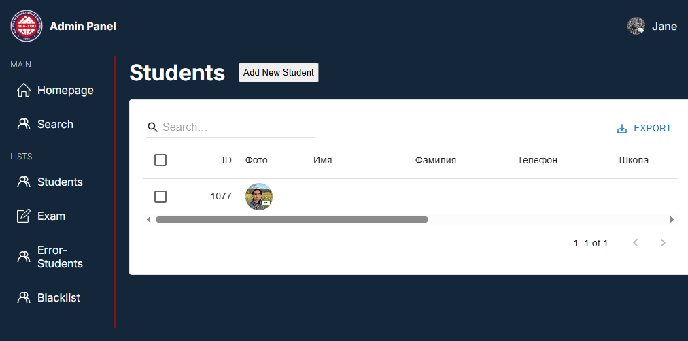
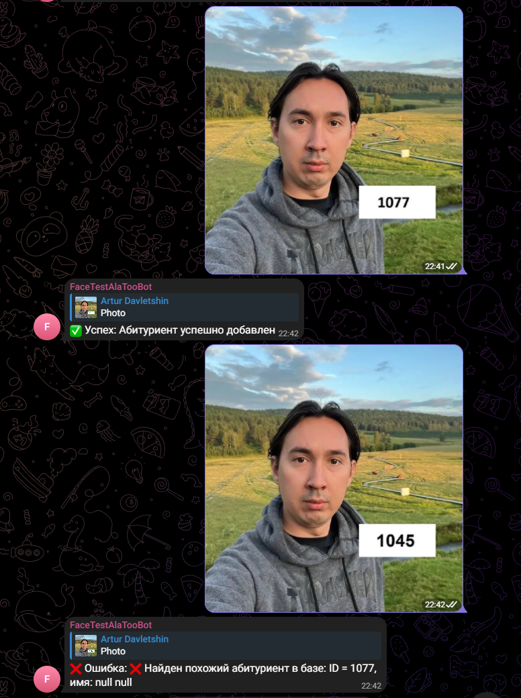
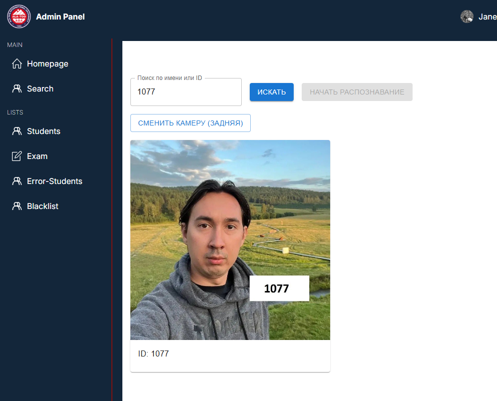

# 🧠 FaceID System Microservice

FaceID System — это микросервисное приложение для распознавания лиц, считывания ID, управления абитуриентами и взаимодействия с Telegram-ботом. Система построена с использованием современных технологий и легко масштабируется.

---

## 📚 Содержание

- [🚀 Возможности](#-возможности)
- [🛠️ Технологии](#️-технологии)
- [🧩 Архитектура микросервисов](#-архитектура-микросервисов)
- [📦 Установка и запуск](#-установка-и-запуск)
- [⚙️ Переменные окружения](#️-переменные-окружения)
- [📸 Примеры работы](#-примеры-работы)
- [🔒 Безопасность](#-безопасность)
- [📈 CI/CD и деплой](#cicd-и-деплой)
- [📄 Лицензия](#-лицензия)

---

## 🚀 Возможности

- Распознавание лиц с использованием `InsightFace`
- Генерация и извлечение эмбеддингов
- Распознавание ID/номеров (через OCR Paddle)
- Backend-логика на Java (Spring Boot)
- Telegram-бот для управления и уведомлений
- Веб-интерфейс на React (Vite)
- Kafka для обмена сообщениями между сервисами
- PostgreSQL как основная БД
- Docker и docker-compose для оркестрации
- Nginx как reverse proxy

---

## 🛠️ Технологии

| Название             | Описание                                      |
|----------------------|-----------------------------------------------|
| **Java + Spring Boot** | REST API, логика управления, интеграция с БД |
| **Python**            | Распознавание лиц и ID                       |
| **React + Vite**      | Веб-интерфейс                                |
| **Telegram Bot API**  | Работа с пользователями                      |
| **Kafka**             | Межсервисное взаимодействие (event-driven)   |
| **PostgreSQL**        | Хранение данных                              |
| **Docker**            | Контейнеризация                              |
| **Nginx**             | Reverse proxy и frontend delivery            |
| **GitHub Actions**    | CI/CD pipeline                               |

---

## 📦 Установка и запуск

1. **Клонируйте репозиторий:**
   ```bash
   git clone https://github.com/mrartur00074/faceID-system-microservice.git
   cd faceID-system-microservice
   ```

2. **Создайте `.env` файл:**
   ```env
   # Postgres DB
   POSTGRES_USERNAME=(название пользователя БД)
   POSTGRES_PASSWORD=(пароль пользователя)
   POSTGRES_HOST=db
   POSTGRES_PORT=5432
   POSTGRES_DB=Django
   
   # Kafka
   KAFKA_SERVERS=kafka:9092
   
   # Backend API
   BACKEND_API_ADDRESS=http://backend:8080/api
   
   # Telegram Bot
   TG_TOKEN=(Токен вашего телеграм бота)
   TG_USERNAME=admin
   TG_PASSWORD=admin
   TG_ADMIN_KEY=admin_artur #(ключевое слово для тг бота для подтверждения админки)
   
   # Frontend
   VITE_BASE_URL=https://compilerwars.ru/api
   VITE_BACKEND_URL=https://compilerwars.ru/
   ```

3. **Постройте и запустите сервисы:**
   ```bash
   docker compose build
   docker compose up -d
   ```

4. **Frontend доступен на:** `http://localhost`  
5. **Backend API:** `http://localhost:8080/api`  
6. **Kafka (внутри контейнеров):** `kafka:9092`

---

## ⚙️ Переменные окружения

| Переменная            | Назначение                    |
|-----------------------|-------------------------------|
| `TG_TOKEN`            | Токен для Telegram-бота       |
| `TG_USERNAME`         | Логин для доступа             |
| `TG_PASSWORD`         | Пароль администратора         |
| `TG_ADMIN_KEY`        | Ключ для авторизации          |
| `BACKEND_API_ADDRESS` | Внутренний адрес для сервисов |
| `VITE_BASE_URL`       | Внешний адрес для фронтенда   |

---

## 📸 Примеры работы

### 🖼️ Список абитуриентов


### 🔐 Добавление абитуриента через тг-бота


### ⚙️ Поиск абитуриента в системе


---

## 📈 CI/CD и деплой

- Автоматический деплой при пуше в `production`
- Используется GitHub Actions
- Обновление только изменённых сервисов
- Логика разбита по шагам: build → push → pull → compose up

---

## 🛠️ TODO / Планы

- [ ] Добавить админа на фронте и бэкенде
- [ ] Добавить систему экзаменов (проходные баллы, занесение баллов, общий список абитуриентов и их баллов)
- [ ] Интеграцию с гугл формами и таблицами
- [ ] Миграция базы данных (Flyway / Liquibase)
- [ ] Поддержка Requiem модулей на backend
- [ ] Оркестрация через Kubernetes 
- [ ] Добавление системы аналитики
- [ ] Полная переработка структуры фронтенда

---

## 📄 Лицензия

Этот проект распространяется под лицензией MIT.  
Автор: [@mrartur0074](https://github.com/mrartur00074)

---

## 🤝 Контакты

Если у вас есть предложения или вопросы — создавайте issue или пишите напрямую в Telegram: `@mrartur0074`